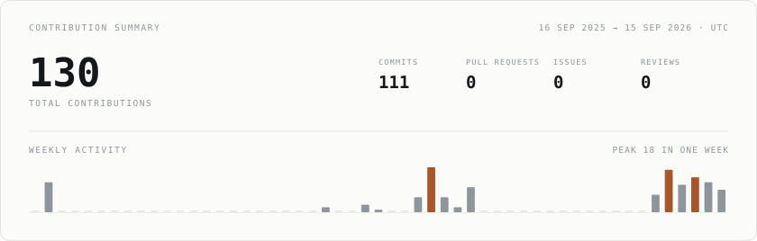
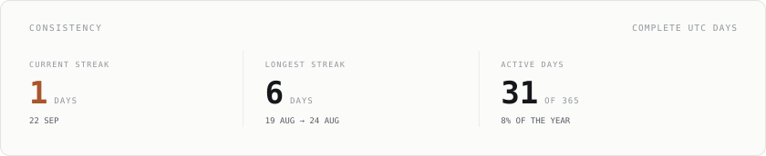
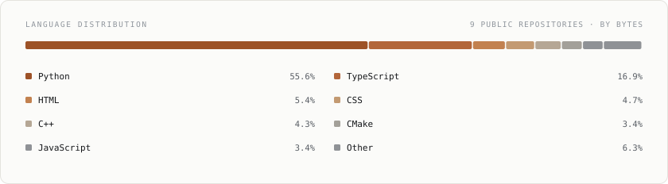
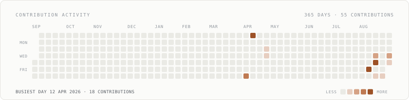

# Josh Jiby

<samp>Computer Science Engineering · SRM Institute of Science and Technology</samp>

## 👋 About

Computer Science Engineering student at SRM Institute of Science and Technology, focused on
building practical software and exploring AI, fintech, and mobile application development.

Currently working with Java, C++, Dart, Flutter, Firebase, and Git, while strengthening my
foundations in data structures, algorithms, and software engineering.

I enjoy turning ideas into functional products, learning new technologies, and continuously
improving through hands-on projects.

**Building. Learning. Shipping.**

## Selected work

**[Razor Recover](https://github.com/Josh-git-lab/razor-recover)**  
<samp>AI-powered payment recovery platform built around intelligent invoice and payment recovery workflows.</samp>

**[Loop Assist](https://github.com/Josh-git-lab/Academic-Assistant-)**  
<samp>AI academic assistant that retrieves from notes, past papers, and study material to answer with citations.</samp>

**[Personal Finance Management System](https://github.com/Josh-git-lab/Personal-Finance-Management-System)**  
<samp>Java application for expense tracking, categorisation, and financial summaries.</samp>

**[La Miraa Salon](https://github.com/Josh-git-lab/LaMiraa-Salon-Website)**  
<samp>Business website designed and deployed for a local salon.</samp>

## Technology

<samp>Java · C++ · C · Dart · Flutter · Firebase · Git · GitHub</samp>

<samp>Currently strengthening — data structures & algorithms · object-oriented programming · software engineering</samp>

## GitHub

<!-- ASCII portrait: add a photo at assets/portrait.jpg, run `python scripts/generate_portrait.py`,
     then uncomment the line below.

-->

***

<samp>Building. Learning. Shipping.</samp>

<samp>Every graphic above is generated inside this repository — no third-party stat or image services. See [`.github/workflows/refresh-profile.yml`](.github/workflows/refresh-profile.yml).</samp>
